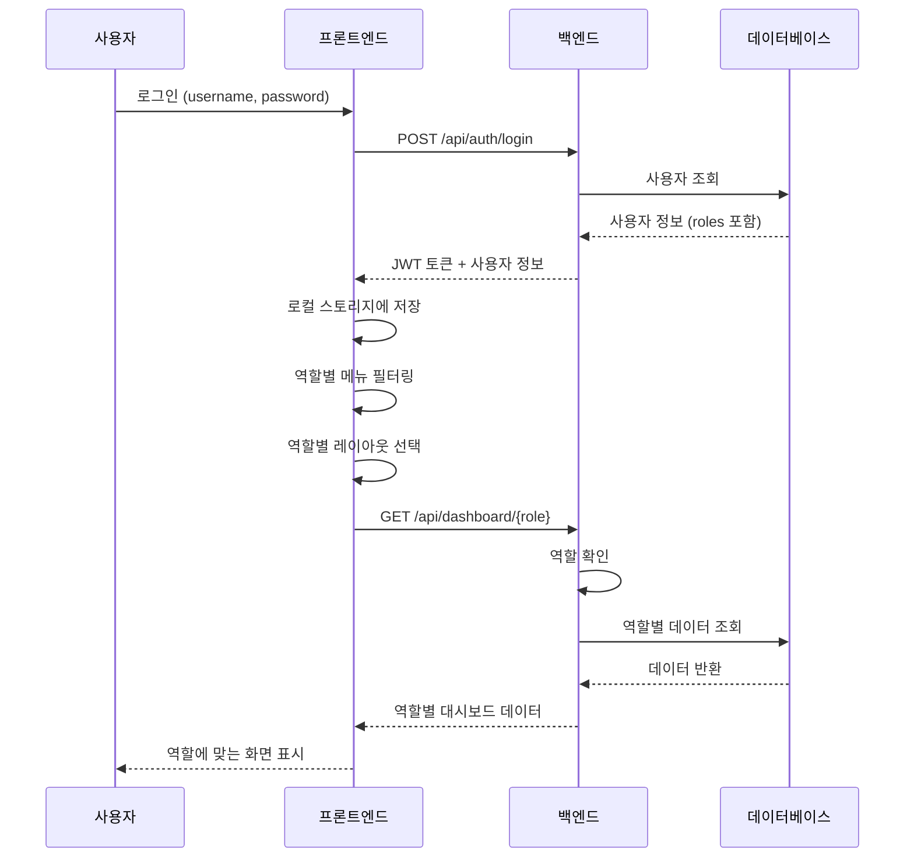

# 성과운영 시스템 구조 설계

> 하나의 통합 시스템에서 역할별 메뉴/화면을 동적으로 구성하는 아키텍처

## 📋 목차
1. [시스템 구조 개요](#시스템-구조-개요)
2. [역할 기반 접근 제어 (RBAC)](#역할-기반-접근-제어-rbac)
3. [메뉴 동적 구성](#메뉴-동적-구성)
4. [데이터베이스 설계](#데이터베이스-설계)
5. [프론트엔드 구조](#프론트엔드-구조)
6. [백엔드 API 구조](#백엔드-api-구조)
7. [ViewLogic 기반 구현](#viewlogic-기반-구현)

---

## 시스템 구조 개요

### 핵심 원칙
✅ **하나의 통합 시스템**
- 별도 시스템 없음
- 공통 데이터베이스
- 공통 백엔드 API
- 역할별 UI만 다르게 표시

✅ **역할 기반 동적 구성**
- 로그인 시 역할 식별
- 역할에 따라 메뉴 자동 생성
- 동일 화면도 역할별 다른 정보 표시

✅ **권한 계층 구조**
```
CEO/임원
  └─ 부서장
      └─ 팀장
          └─ 직원

권한 상속:
- 상위 역할은 하위 역할의 모든 권한 포함
- 예: 팀장은 직원 메뉴 + 관리자 메뉴 모두 접근 가능
```

---

## 역할 기반 접근 제어 (RBAC)

### 역할 정의

```javascript
// 역할 코드 정의
const ROLES = {
  EMPLOYEE: 'EMPLOYEE',        // 일반 직원
  TEAM_LEADER: 'TEAM_LEADER',  // 팀장
  DEPT_HEAD: 'DEPT_HEAD',      // 부서장
  EXECUTIVE: 'EXECUTIVE',      // 임원
  CEO: 'CEO',                  // 대표
  HR: 'HR',                    // 인사팀
  STRATEGY: 'STRATEGY'         // 전략기획팀
};

// 역할 계층 (상위 → 하위 권한 상속)
const ROLE_HIERARCHY = {
  CEO: ['EXECUTIVE', 'DEPT_HEAD', 'TEAM_LEADER', 'EMPLOYEE'],
  EXECUTIVE: ['DEPT_HEAD', 'TEAM_LEADER', 'EMPLOYEE'],
  DEPT_HEAD: ['TEAM_LEADER', 'EMPLOYEE'],
  TEAM_LEADER: ['EMPLOYEE'],
  EMPLOYEE: [],
  HR: ['EMPLOYEE'],  // HR은 모든 직원 데이터 접근
  STRATEGY: ['EMPLOYEE']
};
```

### 사용자 역할 할당

**데이터베이스 테이블: users**
```sql
CREATE TABLE users (
  user_id INT PRIMARY KEY,
  username VARCHAR(50),
  email VARCHAR(100),
  name VARCHAR(100),
  -- 다중 역할 지원 (JSON 배열)
  roles JSON DEFAULT '["EMPLOYEE"]',
  -- 예: ["EMPLOYEE", "TEAM_LEADER"]

  -- 소속 조직
  dept_id INT,        -- 부서
  team_id INT,        -- 팀
  position VARCHAR(50),  -- 직위

  created_at TIMESTAMP,
  updated_at TIMESTAMP
);

-- 예시 데이터
INSERT INTO users VALUES
  (1, 'ceo', 'ceo@company.com', '김대표', '["CEO", "EXECUTIVE"]', NULL, NULL, '대표이사'),
  (2, 'exec1', 'exec@company.com', '박상무', '["EXECUTIVE"]', 1, NULL, '상무'),
  (3, 'manager1', 'mgr@company.com', '이부장', '["DEPT_HEAD", "TEAM_LEADER"]', 1, 1, '부장'),
  (4, 'leader1', 'lead@company.com', '최팀장', '["TEAM_LEADER"]', 1, 1, '팀장'),
  (5, 'emp1', 'emp@company.com', '홍길동', '["EMPLOYEE"]', 1, 1, '대리');
```

---

## 메뉴 동적 구성

### 메뉴 설정 데이터

**config/menus.json** (또는 데이터베이스)
```json
{
  "menus": [
    {
      "id": "dashboard",
      "name": "대시보드",
      "icon": "🏠",
      "path": "/dashboard",
      "roles": ["EMPLOYEE", "TEAM_LEADER", "EXECUTIVE"],
      "component": "Dashboard"
    },
    {
      "id": "goals",
      "name": "목표",
      "icon": "🎯",
      "path": "/goals",
      "roles": ["EMPLOYEE", "TEAM_LEADER", "EXECUTIVE"],
      "children": [
        {
          "id": "my-goals",
          "name": "나의 목표",
          "path": "/goals/my-goals",
          "roles": ["EMPLOYEE"],
          "component": "MyGoals"
        },
        {
          "id": "team-goals",
          "name": "팀 목표",
          "path": "/goals/team-goals",
          "roles": ["TEAM_LEADER", "DEPT_HEAD"],
          "component": "TeamGoals"
        },
        {
          "id": "company-goals",
          "name": "전사 목표",
          "path": "/goals/company-goals",
          "roles": ["EXECUTIVE", "CEO", "STRATEGY"],
          "component": "CompanyGoals"
        }
      ]
    },
    {
      "id": "execution",
      "name": "실행",
      "icon": "⚡",
      "path": "/execution",
      "roles": ["EMPLOYEE"],
      "children": [
        {
          "id": "daily-log",
          "name": "오늘의 업무",
          "path": "/execution/daily-log",
          "roles": ["EMPLOYEE"],
          "component": "DailyLog"
        },
        {
          "id": "weekly-report",
          "name": "이번 주",
          "path": "/execution/weekly-report",
          "roles": ["EMPLOYEE"],
          "component": "WeeklyReport"
        },
        {
          "id": "history",
          "name": "실행 이력",
          "path": "/execution/history",
          "roles": ["EMPLOYEE"],
          "component": "ExecutionHistory"
        }
      ]
    },
    {
      "id": "growth",
      "name": "성장",
      "icon": "🌱",
      "path": "/growth",
      "roles": ["EMPLOYEE", "TEAM_LEADER"],
      "children": [
        {
          "id": "my-growth",
          "name": "나의 성장 맵",
          "path": "/growth/my-growth",
          "roles": ["EMPLOYEE"],
          "component": "MyGrowth"
        },
        {
          "id": "team-growth",
          "name": "팀 성장",
          "path": "/growth/team-growth",
          "roles": ["TEAM_LEADER"],
          "component": "TeamGrowth"
        }
      ]
    },
    {
      "id": "checkin",
      "name": "점검",
      "icon": "🔍",
      "path": "/checkin",
      "roles": ["TEAM_LEADER", "DEPT_HEAD", "EXECUTIVE"],
      "children": [
        {
          "id": "monitoring",
          "name": "실시간 모니터링",
          "path": "/checkin/monitoring",
          "roles": ["TEAM_LEADER"],
          "component": "Monitoring"
        },
        {
          "id": "one-on-one",
          "name": "1:1 미팅",
          "path": "/checkin/one-on-one",
          "roles": ["TEAM_LEADER"],
          "component": "OneOnOne"
        }
      ]
    },
    {
      "id": "review",
      "name": "평가",
      "icon": "📝",
      "path": "/review",
      "roles": ["EMPLOYEE", "TEAM_LEADER", "HR"],
      "component": "Review"
    },
    {
      "id": "analytics",
      "name": "분석",
      "icon": "📊",
      "path": "/analytics",
      "roles": ["EXECUTIVE", "CEO", "STRATEGY"],
      "component": "Analytics"
    },
    {
      "id": "settings",
      "name": "설정",
      "icon": "⚙️",
      "path": "/settings",
      "roles": ["TEAM_LEADER", "HR"],
      "component": "Settings"
    }
  ]
}
```

### 메뉴 필터링 로직

**src/utils/menuFilter.js**
```javascript
/**
 * 사용자 역할에 맞는 메뉴만 필터링
 */
export function filterMenusByRole(menus, userRoles) {
  return menus
    .filter(menu => {
      // 메뉴에 필요한 역할과 사용자 역할 중 겹치는 게 있는지 확인
      return menu.roles.some(role => userRoles.includes(role));
    })
    .map(menu => {
      // 하위 메뉴도 필터링
      if (menu.children) {
        const filteredChildren = filterMenusByRole(menu.children, userRoles);
        return {
          ...menu,
          children: filteredChildren
        };
      }
      return menu;
    });
}

// 사용 예시
const user = {
  roles: ['EMPLOYEE', 'TEAM_LEADER']
};

const allMenus = require('./config/menus.json').menus;
const userMenus = filterMenusByRole(allMenus, user.roles);

console.log(userMenus);
// 결과: 직원 메뉴 + 팀장 메뉴만 표시
```

---

## 데이터베이스 설계

### 주요 테이블 구조

```sql
-- 1. 사용자 테이블
CREATE TABLE users (
  user_id INT PRIMARY KEY AUTO_INCREMENT,
  username VARCHAR(50) UNIQUE,
  email VARCHAR(100) UNIQUE,
  name VARCHAR(100),
  roles JSON,  -- ["EMPLOYEE", "TEAM_LEADER"]
  dept_id INT,
  team_id INT,
  position VARCHAR(50),
  created_at TIMESTAMP DEFAULT CURRENT_TIMESTAMP
);

-- 2. 조직 구조
CREATE TABLE departments (
  dept_id INT PRIMARY KEY AUTO_INCREMENT,
  dept_name VARCHAR(100),
  head_user_id INT,  -- 부서장
  created_at TIMESTAMP DEFAULT CURRENT_TIMESTAMP
);

CREATE TABLE teams (
  team_id INT PRIMARY KEY AUTO_INCREMENT,
  team_name VARCHAR(100),
  dept_id INT,
  leader_user_id INT,  -- 팀장
  created_at TIMESTAMP DEFAULT CURRENT_TIMESTAMP
);

-- 3. 전사 KPI
CREATE TABLE company_kpis (
  kpi_id INT PRIMARY KEY AUTO_INCREMENT,
  kpi_name VARCHAR(200),
  bsc_perspective ENUM('재무', '고객', '프로세스', '학습성장'),
  owner_user_id INT,  -- 담당 임원
  target_value DECIMAL(10,2),
  current_value DECIMAL(10,2),
  year INT,
  created_at TIMESTAMP DEFAULT CURRENT_TIMESTAMP
);

-- 4. 팀 KPI
CREATE TABLE team_kpis (
  team_kpi_id INT PRIMARY KEY AUTO_INCREMENT,
  team_id INT,
  company_kpi_id INT,  -- 상위 전사 KPI 연결
  kpi_name VARCHAR(200),
  target_value DECIMAL(10,2),
  current_value DECIMAL(10,2),
  created_at TIMESTAMP DEFAULT CURRENT_TIMESTAMP
);

-- 5. 개인 MBO
CREATE TABLE mbos (
  mbo_id INT PRIMARY KEY AUTO_INCREMENT,
  user_id INT,
  team_kpi_id INT,  -- 상위 팀 KPI 연결 (필수)
  mbo_name VARCHAR(200),
  mbo_type ENUM('정량', '정성'),
  target_value DECIMAL(10,2),
  current_value DECIMAL(10,2),
  weight INT,  -- 가중치 (%)
  year INT,
  half ENUM('상반기', '하반기'),
  created_at TIMESTAMP DEFAULT CURRENT_TIMESTAMP
);

-- 6. 일일 업무 로그
CREATE TABLE daily_logs (
  log_id INT PRIMARY KEY AUTO_INCREMENT,
  user_id INT,
  mbo_id INT,  -- 연결된 MBO
  log_date DATE,
  task_name VARCHAR(200),
  hours DECIMAL(4,2),  -- 소요 시간 (선택)
  memo TEXT,
  created_at TIMESTAMP DEFAULT CURRENT_TIMESTAMP
);

-- 7. 주간 보고
CREATE TABLE weekly_reports (
  report_id INT PRIMARY KEY AUTO_INCREMENT,
  user_id INT,
  year INT,
  week_number INT,
  week_start_date DATE,
  week_end_date DATE,
  goals TEXT,  -- 이번 주 목표
  results TEXT,  -- 실행 결과
  issues TEXT,  -- 이슈/어려웠던 점
  next_actions TEXT,  -- 다음 주 할 일
  submitted_at TIMESTAMP,
  created_at TIMESTAMP DEFAULT CURRENT_TIMESTAMP
);

-- 8. 역량 평가
CREATE TABLE competencies (
  comp_id INT PRIMARY KEY AUTO_INCREMENT,
  user_id INT,
  comp_name VARCHAR(100),  -- 기획력, 리더십, 협업 등
  score INT,  -- 0-100점
  evaluated_date DATE,
  created_at TIMESTAMP DEFAULT CURRENT_TIMESTAMP
);

-- 9. 피드백
CREATE TABLE feedbacks (
  feedback_id INT PRIMARY KEY AUTO_INCREMENT,
  from_user_id INT,  -- 피드백 준 사람
  to_user_id INT,    -- 피드백 받은 사람
  feedback_type ENUM('긍정', '개선'),
  comp_name VARCHAR(100),  -- 관련 역량
  content TEXT,
  score_impact INT,  -- 역량 점수 영향 (+5, -3 등)
  created_at TIMESTAMP DEFAULT CURRENT_TIMESTAMP
);

-- 10. 1:1 미팅
CREATE TABLE one_on_one_meetings (
  meeting_id INT PRIMARY KEY AUTO_INCREMENT,
  manager_user_id INT,
  employee_user_id INT,
  meeting_date DATE,
  topics TEXT,
  feedback TEXT,
  actions TEXT,
  next_meeting_date DATE,
  created_at TIMESTAMP DEFAULT CURRENT_TIMESTAMP
);

-- 11. 평가
CREATE TABLE reviews (
  review_id INT PRIMARY KEY AUTO_INCREMENT,
  user_id INT,
  year INT,
  review_type ENUM('중간', '최종'),
  quantitative_score DECIMAL(5,2),  -- 정량 점수
  qualitative_score DECIMAL(5,2),   -- 정성 점수
  total_score DECIMAL(5,2),          -- 총점
  grade ENUM('S', 'A', 'B', 'C', 'D'),
  manager_comment TEXT,
  submitted_at TIMESTAMP,
  created_at TIMESTAMP DEFAULT CURRENT_TIMESTAMP
);

-- 12. 학습 계획
CREATE TABLE learning_plans (
  plan_id INT PRIMARY KEY AUTO_INCREMENT,
  user_id INT,
  plan_name VARCHAR(200),
  target_comp VARCHAR(100),  -- 목표 역량
  start_date DATE,
  end_date DATE,
  progress INT DEFAULT 0,  -- 진행률 (0-100)
  status ENUM('계획', '진행중', '완료'),
  created_at TIMESTAMP DEFAULT CURRENT_TIMESTAMP
);

-- 13. 권한 설정
CREATE TABLE permissions (
  permission_id INT PRIMARY KEY AUTO_INCREMENT,
  role VARCHAR(50),
  resource VARCHAR(100),  -- 메뉴 또는 기능
  action VARCHAR(50),     -- read, write, delete 등
  allowed BOOLEAN DEFAULT TRUE
);
```

### 데이터 접근 권한 예시

```sql
-- 데이터 조회 시 역할별 필터링
-- 예: 팀장은 자기 팀원 데이터만 조회

-- 직원: 본인 데이터만
SELECT * FROM mbos WHERE user_id = :current_user_id;

-- 팀장: 자기 팀 전체
SELECT m.* FROM mbos m
JOIN users u ON m.user_id = u.user_id
WHERE u.team_id = (SELECT team_id FROM users WHERE user_id = :current_user_id);

-- 부서장: 자기 부서 전체
SELECT m.* FROM mbos m
JOIN users u ON m.user_id = u.user_id
WHERE u.dept_id = (SELECT dept_id FROM users WHERE user_id = :current_user_id);

-- 임원/CEO: 전사 데이터
SELECT * FROM mbos;
```

---

## 프론트엔드 구조

### 폴더 구조 (ViewLogic 기반)

```
src/
├── views/                    # 페이지 HTML
│   ├── common/               # 공통 컴포넌트
│   │   ├── header.html
│   │   └── sidebar.html
│   ├── layout/               # 레이아웃
│   │   ├── employee.html     # 직원용 레이아웃
│   │   ├── manager.html      # 관리자용 레이아웃
│   │   └── executive.html    # 임원용 레이아웃
│   ├── dashboard/            # 대시보드
│   │   ├── employee.html     # 직원 대시보드
│   │   ├── manager.html      # 관리자 대시보드
│   │   └── executive.html    # 임원 대시보드
│   ├── goals/
│   │   ├── my-goals.html
│   │   ├── team-goals.html
│   │   └── company-goals.html
│   ├── execution/
│   │   ├── daily-log.html
│   │   ├── weekly-report.html
│   │   └── history.html
│   ├── growth/
│   │   ├── my-growth.html
│   │   └── team-growth.html
│   ├── checkin/
│   │   ├── monitoring.html
│   │   └── one-on-one.html
│   └── review/
│       └── review.html
│
├── logic/                    # JavaScript 로직
│   ├── common/
│   │   ├── auth.js           # 인증/권한
│   │   ├── menu.js           # 메뉴 생성
│   │   └── utils.js
│   ├── layout/
│   │   ├── employee.js
│   │   ├── manager.js
│   │   └── executive.js
│   ├── dashboard/
│   │   ├── employee.js
│   │   ├── manager.js
│   │   └── executive.js
│   ├── goals/
│   ├── execution/
│   ├── growth/
│   ├── checkin/
│   └── review/
│
├── components/               # 재사용 컴포넌트
│   ├── ProgressBar.js
│   ├── RadarChart.js
│   ├── RedFlagCard.js
│   └── MBOSelector.js
│
├── config/
│   ├── menus.json           # 메뉴 설정
│   ├── permissions.json     # 권한 설정
│   └── routes.json          # 라우트 설정
│
└── utils/
    ├── roleChecker.js       # 역할 확인
    ├── menuFilter.js        # 메뉴 필터링
    └── dataFilter.js        # 데이터 필터링
```

---

## ViewLogic 기반 구현

### 1. 로그인 & 역할 확인

**src/views/login.html**
```html
<div class="container">
  <h1>로그인</h1>
  <form @submit.prevent="handleLogin">
    <input v-model="username" placeholder="사용자명">
    <input v-model="password" type="password" placeholder="비밀번호">
    <button type="submit">로그인</button>
  </form>
</div>
```

**src/logic/login.js**
```javascript
export default {
  name: 'Login',
  layout: null,  // 레이아웃 없음

  data() {
    return {
      username: '',
      password: ''
    };
  },

  methods: {
    async handleLogin() {
      try {
        // 로그인 API 호출
        const response = await this.$api.post('/api/auth/login', {
          username: this.username,
          password: this.password
        });

        // 토큰 저장
        this.setToken(response.token);

        // 사용자 정보 저장 (로컬 스토리지)
        localStorage.setItem('user', JSON.stringify(response.user));

        // 역할에 따라 대시보드 리다이렉트
        this.redirectByRole(response.user.roles);

      } catch (error) {
        alert('로그인 실패: ' + error.message);
      }
    },

    redirectByRole(roles) {
      // 가장 높은 권한의 대시보드로 이동
      if (roles.includes('CEO') || roles.includes('EXECUTIVE')) {
        this.navigateTo('/dashboard/executive');
      } else if (roles.includes('TEAM_LEADER') || roles.includes('DEPT_HEAD')) {
        this.navigateTo('/dashboard/manager');
      } else {
        this.navigateTo('/dashboard/employee');
      }
    }
  }
};
```

### 2. 동적 메뉴 생성

**src/logic/common/menu.js**
```javascript
import menusConfig from '../../config/menus.json';

export function generateMenus() {
  // 로컬 스토리지에서 사용자 정보 가져오기
  const userStr = localStorage.getItem('user');
  if (!userStr) {
    return [];
  }

  const user = JSON.parse(userStr);
  const userRoles = user.roles || ['EMPLOYEE'];

  // 역할에 맞는 메뉴만 필터링
  return filterMenusByRole(menusConfig.menus, userRoles);
}

function filterMenusByRole(menus, userRoles) {
  return menus
    .filter(menu => {
      // 메뉴 역할과 사용자 역할이 겹치는지 확인
      return menu.roles.some(role => userRoles.includes(role));
    })
    .map(menu => {
      if (menu.children) {
        return {
          ...menu,
          children: filterMenusByRole(menu.children, userRoles)
        };
      }
      return menu;
    });
}
```

### 3. 레이아웃에서 메뉴 표시

**src/views/layout/employee.html**
```html
<div class="layout-employee">
  <header>
    <div class="logo">성과운영 시스템</div>
    <div class="user-info">
      <span>{{ userName }}님</span>
      <button @click="logout">로그아웃</button>
    </div>
  </header>

  <aside class="sidebar">
    <nav>
      <ul>
        <li v-for="menu in menus" :key="menu.id">
          <a :href="'#' + menu.path" :class="{ active: isActive(menu.path) }">
            <span class="icon">{{ menu.icon }}</span>
            <span class="text">{{ menu.name }}</span>
          </a>

          <!-- 하위 메뉴 -->
          <ul v-if="menu.children && menu.children.length > 0" class="submenu">
            <li v-for="child in menu.children" :key="child.id">
              <a :href="'#' + child.path">{{ child.name }}</a>
            </li>
          </ul>
        </li>
      </ul>
    </nav>
  </aside>

  <main class="content">
    <slot></slot>  <!-- 페이지 컨텐츠 -->
  </main>
</div>
```

**src/logic/layout/employee.js**
```javascript
import { generateMenus } from '../common/menu.js';

export default {
  name: 'EmployeeLayout',

  data() {
    return {
      userName: '',
      menus: []
    };
  },

  mounted() {
    // 사용자 정보 로드
    const user = JSON.parse(localStorage.getItem('user'));
    this.userName = user.name;

    // 역할별 메뉴 생성
    this.menus = generateMenus();
  },

  methods: {
    isActive(path) {
      return window.location.hash.includes(path);
    },

    logout() {
      localStorage.removeItem('user');
      localStorage.removeItem('token');
      this.navigateTo('/login');
    }
  }
};
```

### 4. 역할별 대시보드

**src/logic/dashboard/employee.js**
```javascript
export default {
  name: 'EmployeeDashboard',
  layout: 'employee',  // 직원용 레이아웃

  dataURL: '/api/dashboard/employee',

  data() {
    return {
      myGoals: [],
      weeklyTasks: [],
      feedbacks: [],
      growthData: {}
    };
  },

  mounted() {
    // dataURL로 자동 로드된 데이터 사용
    console.log('직원 대시보드 데이터:', this);
  }
};
```

**src/logic/dashboard/manager.js**
```javascript
export default {
  name: 'ManagerDashboard',
  layout: 'manager',  // 관리자용 레이아웃

  dataURL: '/api/dashboard/manager',

  data() {
    return {
      teamStatus: {},
      redFlags: [],
      weeklyStatus: {},
      teamGoals: []
    };
  },

  mounted() {
    console.log('관리자 대시보드 데이터:', this);
  },

  methods: {
    sendReminder(userId) {
      // 독촉 메시지 보내기
      this.$api.post('/api/reminders', { userId });
      alert('독촉 메시지를 보냈습니다.');
    },

    scheduleOneOnOne(userId) {
      // 1:1 미팅 예약
      this.navigateTo('/checkin/one-on-one', { userId });
    }
  }
};
```

### 5. 권한 체크 미들웨어

**src/utils/roleChecker.js**
```javascript
export function hasRole(requiredRoles) {
  const user = JSON.parse(localStorage.getItem('user'));
  if (!user || !user.roles) {
    return false;
  }

  // 사용자 역할 중 하나라도 필요 역할과 일치하면 true
  return requiredRoles.some(role => user.roles.includes(role));
}

export function hasAnyRole(...roles) {
  return hasRole(roles);
}

export function canAccess(menuId, action = 'read') {
  const user = JSON.parse(localStorage.getItem('user'));
  if (!user) return false;

  // permissions.json에서 권한 확인
  // 또는 API 호출로 권한 확인
  return true;  // 구현 필요
}

// Vue 컴포넌트에서 사용
export function requireRole(component, requiredRoles) {
  const originalMounted = component.mounted;

  component.mounted = function() {
    if (!hasRole(requiredRoles)) {
      alert('접근 권한이 없습니다.');
      this.navigateTo('/dashboard');
      return;
    }

    if (originalMounted) {
      originalMounted.call(this);
    }
  };

  return component;
}
```

**사용 예시**
```javascript
import { requireRole } from '../utils/roleChecker.js';

export default requireRole({
  name: 'TeamGoals',
  layout: 'manager',

  // 팀장 이상만 접근 가능
  // ... 컴포넌트 내용
}, ['TEAM_LEADER', 'DEPT_HEAD', 'EXECUTIVE']);
```

---

## 백엔드 API 구조

### API 엔드포인트 예시

```javascript
// Express.js 예시

// 1. 인증 미들웨어
function authenticate(req, res, next) {
  const token = req.headers.authorization?.replace('Bearer ', '');
  if (!token) {
    return res.status(401).json({ error: 'Unauthorized' });
  }

  // 토큰 검증 (JWT 등)
  const user = verifyToken(token);
  req.user = user;
  next();
}

// 2. 역할 확인 미들웨어
function requireRole(...roles) {
  return (req, res, next) => {
    if (!req.user || !req.user.roles) {
      return res.status(403).json({ error: 'Forbidden' });
    }

    const hasRole = roles.some(role => req.user.roles.includes(role));
    if (!hasRole) {
      return res.status(403).json({ error: 'Forbidden' });
    }

    next();
  };
}

// 3. API 라우트
const express = require('express');
const router = express.Router();

// 로그인
router.post('/auth/login', async (req, res) => {
  const { username, password } = req.body;

  // 사용자 인증
  const user = await db.query(
    'SELECT * FROM users WHERE username = ?',
    [username]
  );

  if (!user || !verifyPassword(password, user.password)) {
    return res.status(401).json({ error: 'Invalid credentials' });
  }

  // JWT 토큰 생성
  const token = generateToken(user);

  res.json({
    token,
    user: {
      user_id: user.user_id,
      name: user.name,
      email: user.email,
      roles: JSON.parse(user.roles),
      dept_id: user.dept_id,
      team_id: user.team_id
    }
  });
});

// 직원 대시보드 (직원만)
router.get('/dashboard/employee',
  authenticate,
  requireRole('EMPLOYEE'),
  async (req, res) => {
    const userId = req.user.user_id;

    // 나의 목표 달성률
    const myGoals = await db.query(`
      SELECT * FROM mbos WHERE user_id = ?
    `, [userId]);

    // 이번 주 할 일
    const weeklyTasks = await db.query(`
      SELECT * FROM weekly_reports
      WHERE user_id = ? AND week_number = WEEK(NOW())
    `, [userId]);

    // 최근 피드백
    const feedbacks = await db.query(`
      SELECT * FROM feedbacks
      WHERE to_user_id = ?
      ORDER BY created_at DESC LIMIT 5
    `, [userId]);

    // 성장 현황
    const growthData = await db.query(`
      SELECT comp_name, score FROM competencies
      WHERE user_id = ?
    `, [userId]);

    res.json({
      myGoals,
      weeklyTasks,
      feedbacks,
      growthData
    });
  }
);

// 관리자 대시보드 (팀장 이상)
router.get('/dashboard/manager',
  authenticate,
  requireRole('TEAM_LEADER', 'DEPT_HEAD'),
  async (req, res) => {
    const userId = req.user.user_id;

    // 내 팀 ID
    const teamId = req.user.team_id;

    // 팀 현황
    const teamStatus = await db.query(`
      SELECT
        t.team_name,
        COUNT(u.user_id) as member_count,
        AVG(m.current_value / m.target_value * 100) as avg_achievement
      FROM teams t
      LEFT JOIN users u ON t.team_id = u.team_id
      LEFT JOIN mbos m ON u.user_id = m.user_id
      WHERE t.team_id = ?
      GROUP BY t.team_id
    `, [teamId]);

    // 위험 신호 (Red Flags)
    const redFlags = await db.query(`
      SELECT
        u.name,
        m.mbo_name,
        (m.current_value / m.target_value * 100) as achievement,
        'low_achievement' as flag_type
      FROM mbos m
      JOIN users u ON m.user_id = u.user_id
      WHERE u.team_id = ? AND (m.current_value / m.target_value * 100) < 40

      UNION

      SELECT
        u.name,
        '미작성' as mbo_name,
        0 as achievement,
        'no_report' as flag_type
      FROM users u
      LEFT JOIN weekly_reports w ON u.user_id = w.user_id
        AND w.week_number = WEEK(NOW())
      WHERE u.team_id = ? AND w.report_id IS NULL
    `, [teamId, teamId]);

    res.json({
      teamStatus,
      redFlags
    });
  }
);

// 임원 대시보드 (임원만)
router.get('/dashboard/executive',
  authenticate,
  requireRole('EXECUTIVE', 'CEO'),
  async (req, res) => {
    // 전사 목표 달성 현황
    const companyGoals = await db.query(`
      SELECT
        bsc_perspective,
        AVG(current_value / target_value * 100) as avg_achievement
      FROM company_kpis
      WHERE year = YEAR(NOW())
      GROUP BY bsc_perspective
    `);

    // 부서별 성과
    const deptPerformance = await db.query(`
      SELECT
        d.dept_name,
        AVG(m.current_value / m.target_value * 100) as avg_achievement
      FROM departments d
      LEFT JOIN users u ON d.dept_id = u.dept_id
      LEFT JOIN mbos m ON u.user_id = m.user_id
      GROUP BY d.dept_id
      ORDER BY avg_achievement DESC
    `);

    res.json({
      companyGoals,
      deptPerformance
    });
  }
);

module.exports = router;
```

---

## 시스템 흐름도

### 사용자 로그인부터 메뉴 표시까지



### 권한 체크 흐름

```
1. 사용자 액션
   ↓
2. 프론트엔드 권한 체크 (menuFilter.js)
   → 권한 없음: 메뉴 숨김 또는 접근 차단
   ↓
3. API 요청 (토큰 포함)
   ↓
4. 백엔드 미들웨어 인증
   → 토큰 검증
   ↓
5. 백엔드 미들웨어 권한 체크
   → 역할 확인
   → 권한 없음: 403 Forbidden 반환
   ↓
6. 데이터 조회 (역할별 필터링)
   - 직원: WHERE user_id = :current_user
   - 팀장: WHERE team_id = :current_team
   - 임원: 전체 데이터
   ↓
7. 데이터 반환
```

---

## 핵심 구현 포인트

### ✅ 하나의 시스템
- 동일한 코드베이스
- 동일한 데이터베이스
- 동일한 API 서버
- 역할별로 분기만 다름

### ✅ 메뉴 동적 생성
```javascript
// 설정 파일 기반
menus.json → filterMenusByRole() → 사용자별 메뉴
```

### ✅ 레이아웃 자동 선택
```javascript
// ViewLogic layout 옵션
export default {
  layout: user.roles.includes('EXECUTIVE') ? 'executive' :
          user.roles.includes('TEAM_LEADER') ? 'manager' :
          'employee'
}
```

### ✅ 데이터 권한 필터링
```sql
-- SQL 레벨에서 역할별 필터링
WHERE user_id = :current_user  -- 직원
WHERE team_id IN (...)          -- 팀장
WHERE dept_id IN (...)          -- 부서장
-- WHERE 조건 없음 (전체)        -- 임원
```

### ✅ 프론트/백엔드 이중 체크
- 프론트엔드: UX 향상 (메뉴 숨김)
- 백엔드: 보안 강화 (실제 권한 체크)

---

## 배포 구조

```
[사용자들]
    ↓
[로드 밸런서]
    ↓
[웹 서버 (Nginx)]
    ↓
┌─────────────────────────┐
│  프론트엔드 (SPA)       │
│  - ViewLogic Router     │
│  - 역할별 메뉴 동적 생성 │
└─────────────────────────┘
    ↓ API 요청
┌─────────────────────────┐
│  백엔드 API 서버        │
│  - Node.js/Express      │
│  - JWT 인증             │
│  - 역할별 권한 체크     │
└─────────────────────────┘
    ↓
┌─────────────────────────┐
│  데이터베이스 (MySQL)   │
│  - 통합 스키마          │
│  - 역할별 데이터 필터링 │
└─────────────────────────┘
```

---

## 결론

### 핵심 답변

**Q: 별도 시스템을 만들어야 하나?**
❌ **아니오**. 하나의 통합 시스템으로 구현합니다.

**Q: 하나의 시스템에서 역할별로 나눌 수 있나?**
✅ **예**. 다음 방법으로 가능합니다:

1. **역할 기반 접근 제어 (RBAC)**
   - 사용자에게 역할 부여
   - 역할별 메뉴/화면 필터링

2. **동적 메뉴 생성**
   - 설정 파일 기반
   - 로그인 시 역할 확인
   - 역할에 맞는 메뉴만 표시

3. **공통 데이터베이스**
   - 하나의 DB 스키마
   - 조회 시 역할별 WHERE 조건

4. **조건부 UI 렌더링**
   - 동일 컴포넌트
   - 역할에 따라 다른 데이터 표시

### 장점

✅ **유지보수 용이**
- 하나의 코드베이스
- 버그 수정 한 번에

✅ **데이터 일관성**
- 단일 데이터 소스
- 실시간 동기화 불필요

✅ **확장 가능**
- 새 역할 추가 쉬움
- 메뉴 설정만 업데이트

✅ **비용 절감**
- 하나의 서버
- 하나의 DB

---

## 다음 단계

이 구조를 바탕으로:
1. ✅ ViewLogic 프로젝트 초기 설정
2. ✅ 메뉴 설정 파일 작성
3. ✅ 역할별 레이아웃 구현
4. ✅ 대시보드 페이지 개발
5. ✅ API 서버 구축

---

**문서 정보**
- 작성일: 2026-01-16
- 버전: 1.0
- 작성자: Claude Code
